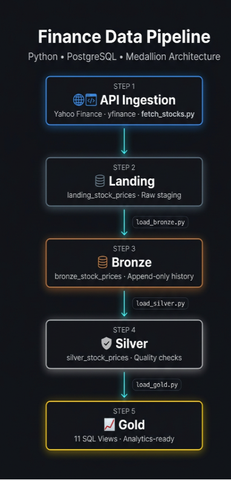
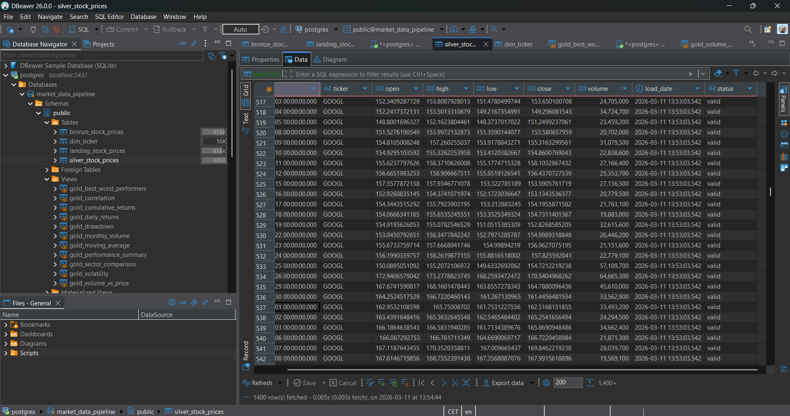
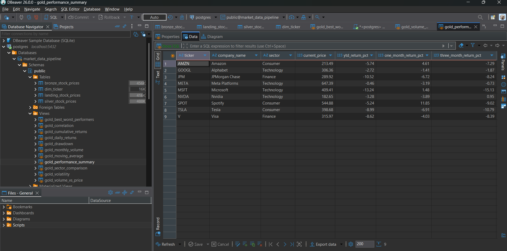
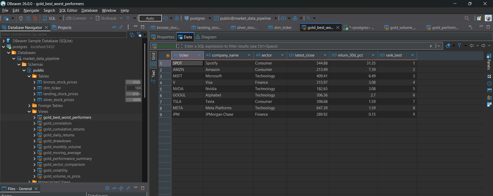
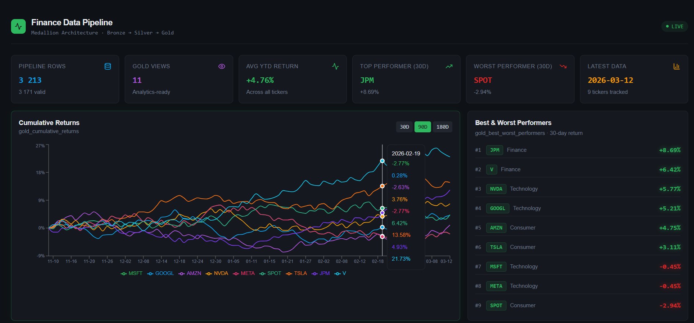

# Finance Data Pipeline

An end-to-end data pipeline that ingests daily stock market data from Yahoo Finance and transforms it through a Medallion Architecture (Landing → Bronze → Silver → Gold) into analytics-ready views in PostgreSQL.

The pipeline runs incrementally, validates data quality at each layer, and exposes 11 SQL views designed for BI and exploratory analysis.

Working with financial market data introduces engineering considerations that generic medallion demos rarely address — such as excluding incomplete intraday data, handling non-trading days in incremental loads, and calculating rolling metrics like drawdown and volatility that require strictly ordered time-series data.

## What this project demonstrates

- API data ingestion from an external source
- Incremental loading based on warehouse state
- Medallion architecture design
- Data quality validation with status flags
- Idempotent pipeline behavior
- Time-series analytics using SQL window functions

---

## Architecture



Data flows through five steps, each with a clear responsibility:

| Step | Script | Table / Object | Purpose |
|---|---|---|---|
| 1 | `fetch_stocks.py` | `landing_stock_prices` | Fetch raw OHLCV from Yahoo Finance API |
| 2 | `load_bronze.py` | `bronze_stock_prices` | Append-only historical store |
| 3 | `load_silver.py` | `silver_stock_prices` | Data quality validation + status flags |
| 4 | `load_dimensions.py` | `dim_ticker` | Company metadata (name, sector, industry) |
| 5 | `load_gold.py` | `gold_*` (11 views) | Analytics-ready SQL views |

---

## Data Model

```
dim_ticker
    ticker (PK)
    company_name
    sector
    industry
    currency
         │
         │ JOIN on ticker
         ▼
silver_stock_prices
    date, ticker, open, high, low, close, volume
    load_date, status (valid / invalid_*)
         │
         │ filtered WHERE status = 'valid'
         ▼
gold_* views (11 analytics views)
```

---

## Tech Stack

| Tool | Purpose |
|---|---|
| Python | Pipeline logic and orchestration |
| yfinance | Yahoo Finance API client |
| pandas | Data manipulation |
| SQLAlchemy | Python → PostgreSQL interface |
| PostgreSQL | Database (all layers) |
| DBeaver | Database GUI |

---

## Dataset

- **Tickers:** MSFT, GOOGL, AMZN, NVDA, META, SPOT, TSLA, JPM, V
- **Sectors:** Technology, Consumer, Finance
- **Fields:** date, open, high, low, close, volume
- **History:** ~2 years of daily OHLCV data
- **Approx. rows:** ~4k validated rows in silver (~2 years of daily data)
- **Update frequency:** Daily incremental load

---

## Key Design Decisions

**Incremental load based on bronze MAX(date)**
Each run checks the latest date already in bronze and fetches only new data from the API. Landing is always replaced (staging), bronze is never touched after insert.

**Append-only bronze with idempotent inserts**
Bronze uses `INSERT ... ON CONFLICT DO NOTHING` against a unique constraint on `(ticker, date)`. Re-running the pipeline never creates duplicates — a deliberate choice over truncate-and-reload.

**Status flagging in silver, not deletion**
Invalid rows are flagged with a status code (`invalid_null`, `invalid_price`, `invalid_high_low`, `invalid_close_range`, `invalid_volume`) and kept in the table. Data lineage is preserved; gold views filter on `WHERE status = 'valid'`.

**Gold as SQL views, not tables**
No data duplication. Views always reflect the latest validated silver data without requiring a separate load step.

**Exclude current day**
`end_date` is set to yesterday to avoid loading partial intraday data that would produce misleading analytics.

**Centralized config**
`config.py` holds database connection, ticker list and logging setup. One change propagates across the entire pipeline.

---

## Gold Views

| View | What it answers |
|---|---|
| `gold_daily_returns` | What was each ticker's daily % return? |
| `gold_moving_average` | Where are 30-day and 90-day moving averages? |
| `gold_performance_summary` | YTD, 1-month and 3-month return per ticker |
| `gold_cumulative_returns` | Total return since first data point |
| `gold_volatility` | Rolling 30-day standard deviation |
| `gold_drawdown` | % drop from historical peak price |
| `gold_monthly_volume` | Average and total volume by month |
| `gold_volume_vs_price` | Volume spikes flagged as `high_volume` signal |
| `gold_sector_comparison` | Relative performance: Tech vs Finance vs Consumer |
| `gold_correlation` | Pairwise return correlation between all tickers |
| `gold_best_worst_performers` | 30-day return ranking across all tickers |

---

## Example Queries

```sql
-- Which tickers had the highest return over the last 30 days?
SELECT ticker, company_name, return_30d_pct, rank_best
FROM gold_best_worst_performers
ORDER BY rank_best;

-- How correlated are NVDA and MSFT?
SELECT ticker_a, ticker_b, correlation
FROM gold_correlation
WHERE (ticker_a = 'NVDA' AND ticker_b = 'MSFT')
   OR (ticker_a = 'MSFT' AND ticker_b = 'NVDA');

-- What is NVDA's daily return for the last 10 trading days?
SELECT ticker, date, daily_return_pct
FROM gold_daily_returns
WHERE ticker = 'NVDA'
ORDER BY date DESC
LIMIT 10;
```

---

## Screenshots

### Pipeline Architecture


### Silver Layer — Validated OHLCV Data


### Gold Layer — Performance Summary


### Gold Layer — Best & Worst Performers (30-day)


## Dashboard Example

Example dashboard built on top of the **Gold layer**.

This demonstrates how the analytics-ready views produced by the pipeline
can be consumed in a reporting or analytics layer.

### Pipeline Overview



### Moving Averages & Volatility


---

## Setup

**Prerequisites**
- Python 3.x
- PostgreSQL running locally
- DBeaver (optional, for browsing data)

**Install dependencies**
```bash
pip install -r requirements.txt
```

**Configure environment**

Copy `.env.example` to `.env` and fill in your credentials:
```
DB_USER=postgres
DB_PASSWORD=your_password
DB_HOST=localhost
DB_PORT=5432
DB_NAME=market_data_pipeline
```

**Run the full pipeline**
```bash
python run_pipeline.py
```

**Or run each step individually**
```bash
python fetch_stocks.py
python load_bronze.py
python load_silver.py
python load_dimensions.py
python load_gold.py
```

**Expected output**
```
2026-03-16 14:15:18 [INFO] Incremental run — loading from 2026-03-14
2026-03-16 14:15:19 [INFO] Rows fetched: 9
2026-03-16 14:15:19 [INFO] Landing loaded: 9 rows — staging area refreshed.
2026-03-16 14:15:20 [INFO] Bronze loaded: 9 new rows inserted, 0 duplicates skipped.
2026-03-16 14:15:21 [INFO] Validation complete — valid: 9, invalid: 0
2026-03-16 14:15:21 [INFO] Silver loaded: 9 rows.
2026-03-16 14:15:22 [INFO] dim_ticker upserted successfully — 9 tickers loaded.
2026-03-16 14:15:24 [INFO] All 11 gold views created successfully.
2026-03-16 14:15:24 [INFO] Pipeline completed in 5 seconds.
```

---

## Known Limitations & Tradeoffs

- **Yahoo Finance is a free public API** — not an enterprise data source. Suitable for learning and portfolio projects; not production-grade for financial systems.
- **Daily granularity only** — intraday data would require a paid API and significantly more storage.
- **No orchestration** — the pipeline is triggered manually. Scheduling via Airflow or cron is a natural next step.
- **Silver validation runs in Python** — for larger datasets this would move into SQL or dbt tests.
- **Nine tickers** — a deliberate scope decision to keep the project focused rather than comprehensive.

---

## Recent Improvements

**Centralized configuration (`config.py`)**
Extracted database connection, ticker list and logging setup into a single module. Previously each script duplicated the same environment variable reads and engine creation.

**Set-based insert in bronze (`load_bronze.py`)**
Replaced a row-by-row Python loop (`iterrows()`) with a single `INSERT INTO bronze SELECT FROM landing ON CONFLICT DO NOTHING`. Eliminates unnecessary round-trips to the database regardless of dataset size. Volume column also corrected from `FLOAT` to `BIGINT`.

**Structured logging**
Replaced all `print()` statements with Python's `logging` module. Every log line now includes a timestamp and severity level, making pipeline behavior traceable without reading source code.

**Error handling in fetch**
Added `try/except` around the Yahoo Finance API call and per-ticker column validation. If a ticker is missing from the API response it is logged and skipped rather than crashing the entire fetch.

**Additional OHLCV validation in silver**
Added a check that closing price falls within the day's high/low range (`low ≤ close ≤ high`). Parameterized the bronze query to replace an f-string with a proper bound parameter.

---

## Possible Extensions

The current pipeline is intentionally kept lightweight for a portfolio project.
Several natural extensions could evolve it toward a production-style data platform:

- **Power BI dashboard** connected directly to the gold analytics views
- **dbt models and tests** to move silver/gold transformations into a modern analytics workflow
- **Apache Airflow orchestration** for scheduled daily pipeline runs
- **Docker containerization** to simplify deployment and reproducibility
- **Unit tests** for validation logic and pipeline components